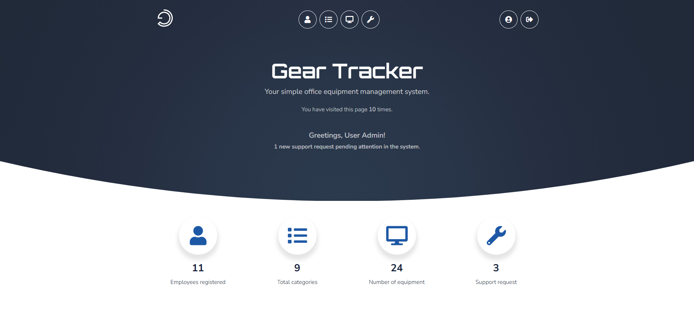
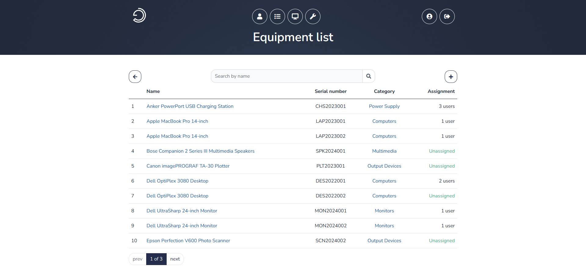
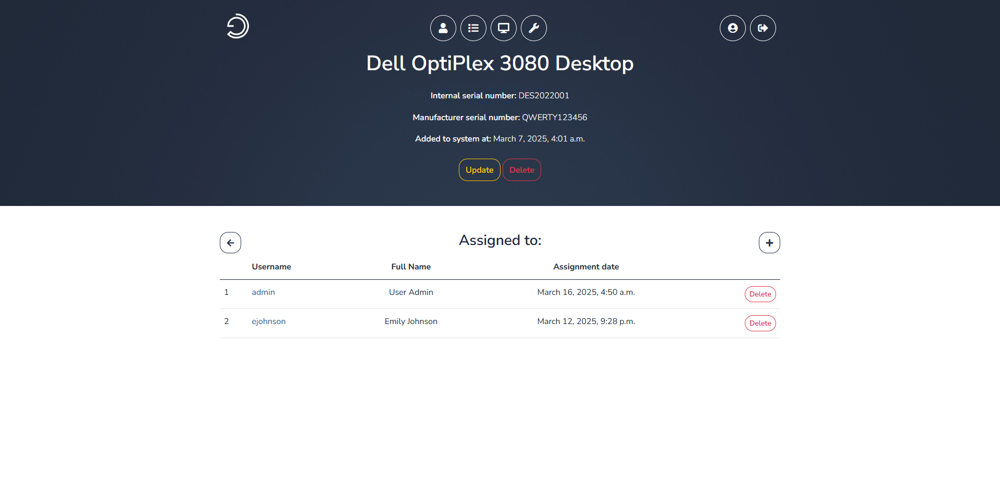

# office-inventory-system

* [Main Technologies](#main-technologies)
* [Key Features](#key-features)
* [Installation](#installation)
* [Usage](#usage)
* [Additional Information](#additional-information)

A simple application for tracking office equipment, with three user types - Administrator, Support, Employee, the ability to submit service requests and assign equipment to different users.

## Demo

* Website: https://gear-tracker.onrender.com
* Test User: `employee` / `support` / `admin`
* Password: `1qazcde3`

<details>
  <summary>Screenshots</summary>

**Homepage example**
  

---
**List page example**
  

---
**Detail page example**
  

</details>


## Main Technologies

* Python
* Django
* PostgreSQL
* SQLite
* HTML5
* CSS3
* Bootstrap

## Key Features

* **Equipment Assignment to Employee(s):** Allows assigning equipment to specific users, ensuring clear tracking.
* **Internal Serial Number System with Validation:** Ensures the uniqueness of each piece of equipment through serial number validation, preventing errors and duplication.
* **Service Request Submission System:** Simplifies the process of submitting repair or maintenance requests for equipment, ensuring efficient response to issues.
* **Three User Types (Administrator, Support, Employee):** Distribution of access rights according to user roles, ensuring security and control.
* **Responsive design** for various devices.

## Installation

1.  Clone the repository: 
    ```bash
    1. git clone https://github.com/YBlck/office-inventory-system.git
    ```
2.  Create a virtual environment:
    ```bash
    python -m venv venv
    ```
3. Activate the virtual environment:
    * Windows:
    ```bash
    venv\Scripts\activate
    ```
    * macOS/Linux: 
    ```bash
    source venv/bin/activate
    ```
4.  Install dependencies:
    ```bash
    pip install -r requirements.txt
    ```
5.  Run migrations:
    ```bash
    python manage.py migrate
    ```
6.  Create a superuser: 
    ```bash
    python manage.py createsuperuser
    ```
7.  Start the server: 
    ```bash
    python manage.py runserver
    ```

**Note:** For local development, SQLite is used. For production, PostgreSQL is recommended.

## Usage

1.  Open a browser and go to `http://127.0.0.1:8000/`.
2.  Log in using administrator credentials (or create a new user).
3.  Use the navigation menu to access system functions.


## Additional Information

* The application uses the PostgreSQL (SQLite for local run) database for data storage.
* The standard Django authentication system is used to configure user access rights.
